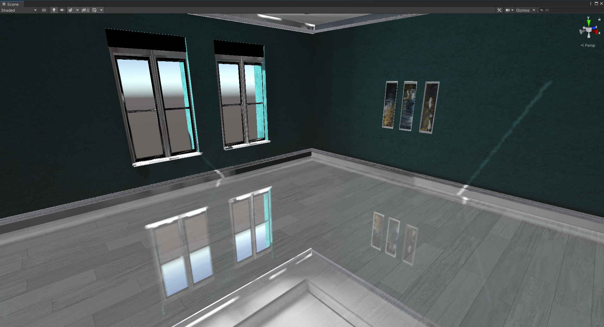
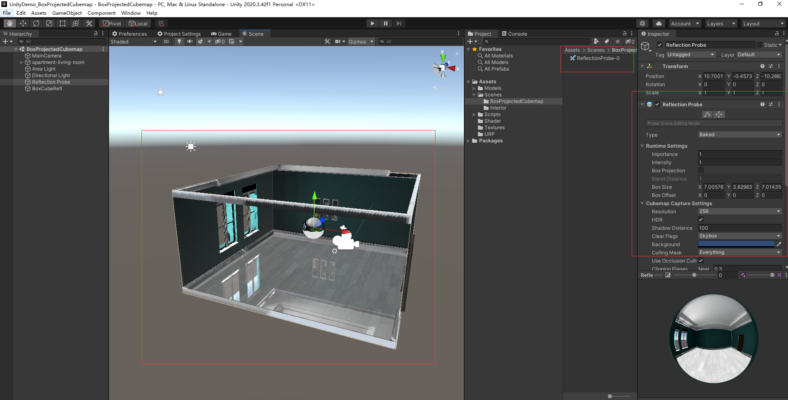

# 盒子投影 Cubemap

[← 返回主页](../../README.md)

适用于矩形场景的 Cubemap 盒子投影效果，能对墙壁上的门、窗、画等物件产生正确的反射投影。

## 示例与在线体验

- **Unity 示例工程（Demo）**：[com.spacetime.effect.sample.boxprojectedcubemap](https://github.com/xieliujian/com.spacetime.effect.sample.boxprojectedcubemap)
- **Web 在线预览（WebGL）**：[Box Projected Cubemap](https://xieliujian.github.io/xieliujian_page/spacetime/effect/boxprojectedcubemap/)

---

## 展示效果



---

## 快速开始

### 第一步：创建 ReflectionProbe

在场景中创建一个 `ReflectionProbe`，包裹住整个场景，拍照生成 CubeMap。



### 第二步：复制 ReflectionProbe 参数

选中挂有 `ReflectionProbeParam` 组件的 GameObject，右键执行：

```
GameObject > BoxProjectedCubemapDirection_Copy
```

`ReflectionProbeParam` 组件会自动实时同步 ReflectionProbe 的包围盒数据：

```csharp
// ReflectionProbeParam 每帧自动更新以下属性
reflProbeCenter = m_ReflProbe.bounds.center;
reflProbeBoxMin  = m_ReflProbe.bounds.min;
reflProbeBoxMax  = m_ReflProbe.bounds.max;
```

### 第三步：粘贴到反射材质

选中目标反射物件，右键执行：

```
GameObject > BoxProjectedCubemapDirection_Paste
```

工具将把以下 Shader 属性写入目标物件的 `sharedMaterial`：

| 属性 | 说明 |
|------|------|
| `_UseBoxCubeRefl` | 启用盒子投影（自动设为 1） |
| `_BoxCubeReflCenter` | 盒子投影中心位置 |
| `_BoxCubeReflBoxMin` | 盒子投影包围盒最小点 |
| `_BoxCubeReflBoxMax` | 盒子投影包围盒最大点 |

---

## Shader 核心算法

`BoxProjectedCubemapDirection` 函数将反射向量从视角空间修正为正确的盒子投影坐标：

```hlsl
// worldRefl    — 反射向量
// worldPos     — 顶点世界空间位置
// cubemapCenter — 盒子投影中心
// boxMin       — 包围盒最小点
// boxMax       — 包围盒最大点
// 返回值       — 修正后的投影坐标

half3 BoxProjectedCubemapDirection(half3 worldRefl, float3 worldPos,
    float4 cubemapCenter, float4 boxMin, float4 boxMax)
{
    half3 nrdir = normalize(worldRefl);

    half3 rbmax = (boxMax.xyz - worldPos) / nrdir;
    half3 rbmin = (boxMin.xyz - worldPos) / nrdir;

    half3 boolDir  = (nrdir > 0.0f);
    half3 rbminmax = boolDir * rbmax + (1 - boolDir) * rbmin;

    half fa = min(min(rbminmax.x, rbminmax.y), rbminmax.z);

    worldPos -= cubemapCenter.xyz;
    worldRefl = worldPos + nrdir * fa;

    return worldRefl;
}
```

---

## 核心特性

- **矩形场景优化** — 专为矩形房间、走廊等方盒型空间设计，投影精度高
- **编辑器工具** — Copy/Paste 菜单一键同步 ReflectionProbe 参数到材质，无需手动填写
- **实时同步** — `ReflectionProbeParam` 组件在 EditMode 和 PlayMode 下均实时更新包围盒数据
- **材质安全写入** — Paste 时自动检查属性是否存在，避免无关材质被误修改

---

## 参考资料

- [Catlike Coding - Rendering Part 8（第三章）](https://catlikecoding.com/unity/tutorials/rendering/part-8/)

---

[← 返回主页](../../README.md)
