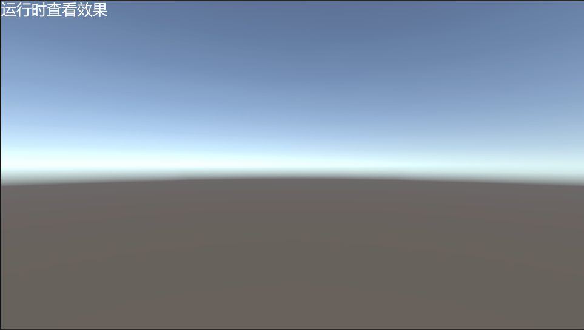
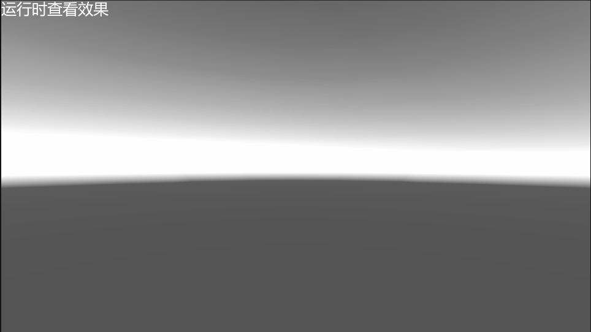

# SceneGray 场景灰度

[← 返回主页](../../README.md)

通过 URP Volume 的 `ColorAdjustments` 切换场景灰度（降饱和度 + 对比度/曝光微调），适用于死亡、过场、UI 强调等需要整体去色的场景。

---

## 展示效果

### 原始效果

### 灰化效果

---

## 快速开始

### 第一步：准备 Volume

场景中创建或选中 `Volume`（Global / Local），确保 Profile 中已添加 `Color Adjustments` Override。

### 第二步：挂载组件

在同一 GameObject 上添加 `UrpSceneGray`（命名空间 `ST.Effect`）。

### 第三步：切换效果

- **编辑器**：Inspector 中点击「切换效果」
- **运行时 / WebGL**：屏幕右上角点击「切换效果」按钮（按 `Screen` 宽度相对 1920 自适应缩放）
- **代码**：调用 `UrpSceneGray.SwitchEff()`

屏幕左上角会显示「运行时查看效果」提示文案。

---

## 参数说明

灰度开/关参数集中在 `SceneGrayDefine`：

| 字段 | 灰度开 | 灰度关 | 说明 |
|------|--------|--------|------|
| `s_GrayPostExposure` / `s_NormalPostExposure` | -0.1 | 0 | 曝光 |
| `s_GrayContrast` / `s_NormalContrast` | 40 | 0 | 对比度 |
| `s_GrayHueShift` / `s_NormalHueShift` | 0 | 0 | 色相偏移 |
| `s_GraySaturation` / `s_NormalSaturation` | -100 | 0 | 饱和度（-100 为完全去色） |

组件通过 `volume.sharedProfile` 写入上述值，与 Demo 行为一致。

---

## 相关脚本

| 脚本 | 路径 |
|------|------|
| `SceneGrayDefine` | `Runtime/Scripts/SceneGray/SceneGrayDefine.cs` |
| `UrpSceneGray` | `Runtime/Scripts/SceneGray/UrpSceneGray.cs` |
| `UrpSceneGrayEditor` | `Editor/Scripts/SceneGray/UrpSceneGrayEditor.cs` |
