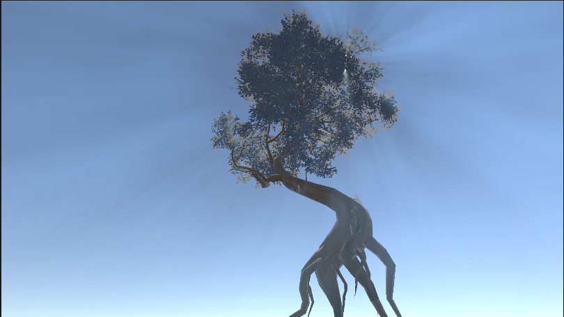
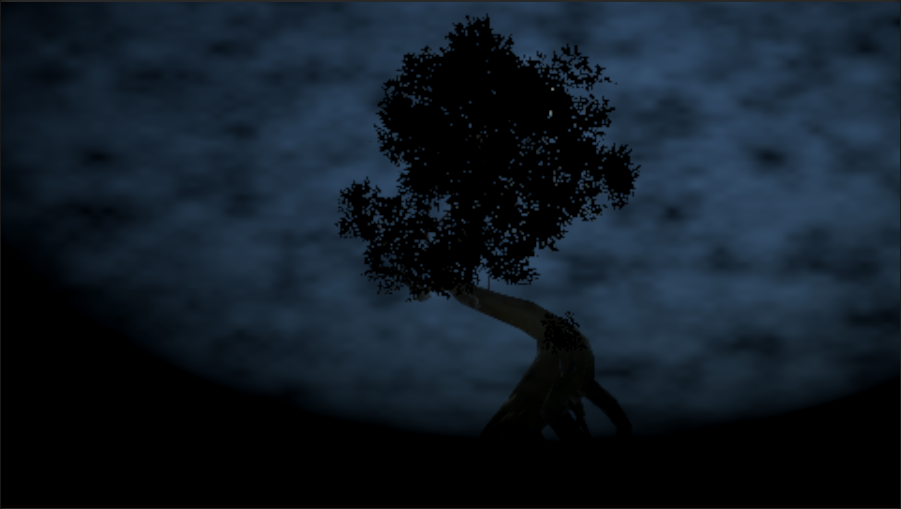
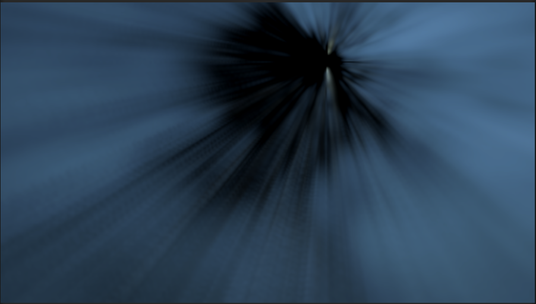
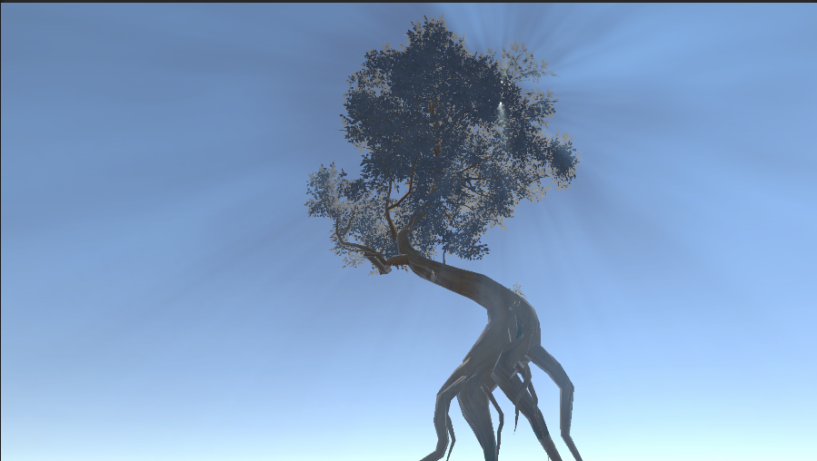

# SunShaft 光线

[← 返回主页](../../README.md)

基于 URP ScriptableRendererFeature 的太阳光轴（体积光）后处理效果，通过三步渲染管线实现天空采样、径向模糊与场景混合。

---

## 展示效果



---

## 快速开始

### 第一步：添加 Renderer Feature

在 URP Renderer Asset 中添加 `SunShaftsFeatureV2`：

```
Universal Renderer Data > Add Renderer Feature > SunShaftsFeatureV2
```

### 第二步：添加 Volume 组件

在场景中创建 Volume（Global 或 Local），添加 `Post-processing > SunShafts` Override：

```
Add Override > Post-processing > SunShafts
```

将 `On` 开启即可启用效果。

### 第三步：配置参数

| 参数 | 默认值 | 说明 |
|------|--------|------|
| `On` | false | 启用/禁用效果 |
| `Force On` | false | 强制开启，跳过角度可见性裁剪 |
| `Intensity` | 1.5 | 光柱强度（0–5） |
| `Use Sun Light Color` | true | 使用主方向光颜色作为光柱颜色 |
| `Shafts Color` | black | 自定义光柱颜色（HDR） |
| `Use Sun Position` | false | 手动指定太阳位置 |
| `Sun Position` | Vector3.zero | 自定义太阳世界坐标 |
| `Sun Threshold Sky` | 0.75 | 天空采样范围阈值（0–1） |
| `Depth Downscale Pow2` | 3 | 降采样级别（0–4） |
| `Blur Radius` | 1.2 | 径向模糊半径 |
| `Blur Steps Count` | 2 | 径向模糊迭代次数（1–4） |
| `Use Stencil Mask Tex` | false | 启用模板遮罩纹理 |
| `Use Render Pass Event` | false | 自定义 RenderPass 插入时机 |

---

## 渲染管线

SunShaft 效果分三个 Pass 顺序执行：

### Pass 1 — 采样天空光线颜色

从当前帧的场景深度缓冲区中提取天空区域，仅保留靠近太阳位置的像素，叠加噪声扰动增强自然感。



```hlsl
float4 frag(Varyings input) : SV_Target
{
    float4 uv = input.uv;
    float4 screenPos = input.ScreenPosition;

    float disFromSun = length(_SunPosition.xy - uv.xy);
    float limitSkyBySunDis = saturate(_SunThresholdSky - disFromSun);

    float sceneDepth = Linear01Depth(SHADERGRAPH_SAMPLE_SCENE_DEPTH(screenPos.xy / screenPos.w), _ZBufferParams);
    float sceneDepthComp = (sceneDepth >= 0.99) ? 1 : 0;
    limitSkyBySunDis *= sceneDepthComp;

    float4 mainTexColor = SAMPLE_TEXTURE2D(_MainTex, sampler_MainTex, uv.xy);
    float noiseVal;
    Unity_SimpleNoise_float(uv.xy, _SkyNoiseScale, noiseVal);
    mainTexColor *= noiseVal;

    return mainTexColor * limitSkyBySunDis;
}
```

### Pass 2 — 径向模糊

以太阳屏幕坐标为中心，对 Pass 1 结果进行多次偏移采样叠加，产生向太阳方向延伸的光轴拖影。



```hlsl
float4 frag(Varyings input) : SV_Target
{
    float4 uv = input.uv;
    float2 uvOffset = (_SunPosition.xy - uv.xy) * _BlurStep;

    // 6 次递进偏移采样
    float4 c0 = SAMPLE_TEXTURE2D(_MainTex, sampler_MainTex, uv.xy);
    float4 c1 = SAMPLE_TEXTURE2D(_MainTex, sampler_MainTex, uv.xy + uvOffset);
    float4 c2 = SAMPLE_TEXTURE2D(_MainTex, sampler_MainTex, uv.xy + uvOffset * 2);
    float4 c3 = SAMPLE_TEXTURE2D(_MainTex, sampler_MainTex, uv.xy + uvOffset * 4);
    float4 c4 = SAMPLE_TEXTURE2D(_MainTex, sampler_MainTex, uv.xy + uvOffset * 8);
    float4 c5 = SAMPLE_TEXTURE2D(_MainTex, sampler_MainTex, uv.xy + uvOffset * 16);

    return (c0 + c1 + c2 + c3 + c4 + c5) / 6;
}
```

### Pass 3 — 与场景混合

将径向模糊结果乘以强度和颜色，可选地通过模板遮罩纹理控制投影范围，最终叠加到场景颜色上。



```hlsl
float4 frag(Varyings input) : SV_Target
{
    float4 uv = input.uv;

    float4 shaftTexColor = SAMPLE_TEXTURE2D(_TmpBlurTex1, sampler_TmpBlurTex1, uv.xy);
    shaftTexColor = saturate(shaftTexColor * _Intensity) * _ShaftsColor;

    float4 maskTexColor = SAMPLE_TEXTURE2D(_StencilMaskTex, sampler_StencilMaskTex, uv.xy);
    float maskVal = saturate(1 - saturate(maskTexColor));
    maskVal = _UseStencilMaskTex * maskVal + (1 - _UseStencilMaskTex);
    shaftTexColor *= maskVal;

    float4 mainTexColor = SAMPLE_TEXTURE2D(_MainTex, sampler_MainTex, uv.xy);
    return mainTexColor + shaftTexColor;
}
```

---

## 核心特性

- **URP 原生集成** — 基于 `ScriptableRendererFeature` + `ScriptableRenderPass`，无侵入式接入 URP 渲染管线
- **Volume 驱动** — 所有参数通过 `VolumeComponent` 管理，支持全局/局部混合与过渡
- **可见性自动裁剪** — 摄像机与太阳角度超过阈值时自动跳过渲染，节省 GPU 开销
- **多级降采样** — 可配置的降采样倍率（1–16×），平衡画质与性能
- **模板遮罩支持** — 支持自定义遮罩纹理，精确控制光轴投影区域
- **动态光源颜色** — 可直接读取主方向光颜色，与场景光照保持一致

---

## 架构

```
SunShaftsFeatureV2（ScriptableRendererFeature）
  ↓ Create()
SunShaftsPass（ScriptableRenderPass）
  ↓ Execute()
  ├── Pass 1: BuildSkyForBlurShader    — 天空区域采样
  ├── Pass 2: DirectionalBlurShader    — 径向模糊（多次迭代）
  └── Pass 3: FinalBlendShader         — 与场景颜色叠加

SunShafts（VolumeComponent）          — Volume 参数容器
SunShaftsProperties                   — Feature Inspector 参数
```

---

## 依赖

- Unity Engine
- Universal Render Pipeline (URP)
- `UnityEngine.Rendering.Universal`

---

[← 返回主页](../../README.md)
